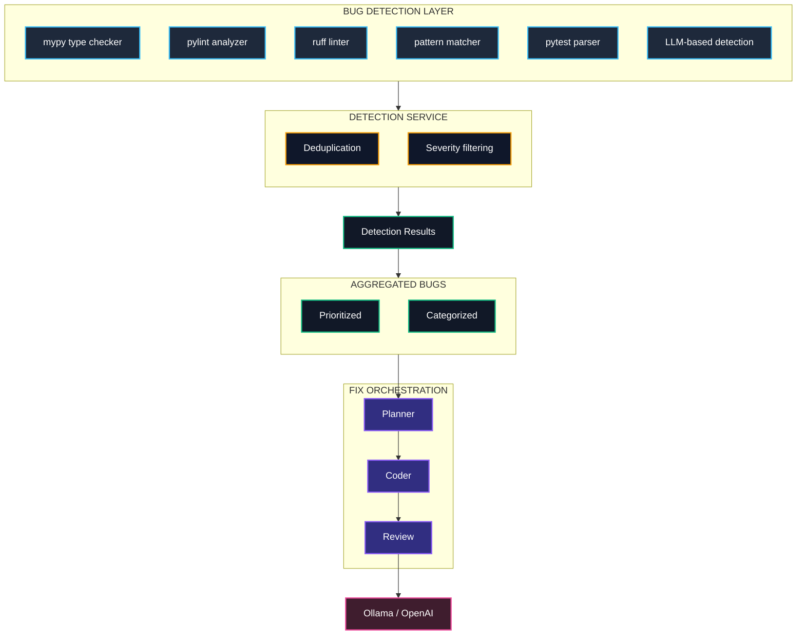

# AI bug fixer (Python)

**AI bug fixer** is an AI project designed to detect bugs in python files (using static analyzers and optionally a LLM) and apply fixes (using a multiagent LLM setup).

## Features

### Core Features
- **AST-Based Code Chunking**: Extracts semantic entities (functions, classes, methods) with precise line tracking
- **Multi-Agent Orchestration during fix**: Planner → RAG Retrieval → Coder → Reviewer with retry loop.
- **Dual LLM Support**: Switch via configuration between OpenAI models and Ollama models.
- **Retry Logic**: Reviewer can reject fixes and trigger up to 3 retry attempts with feedback
- **Hybrid RAG Search**: Semantic similarity + keyword matching for optimal context retrieval

### Automated Bug Detection
- **Static Analysis Integration**: Runs mypy, pylint, and ruff to automatically detect bugs
- **Pattern-Based Detection**: Finds common anti-patterns (bare except, mutable defaults, etc.)
- **LLM-based Detection**: Uses a LLM to detect bugs
- **Deduplication**: Automatically deduplicates bugs from multiple sources
- **Severity Filtering**: Filter by ERROR, WARNING, or INFO level

### Interactive Bug Fixing
- **Auto-Detection**: Find bugs without manual description
- **Interactive Mode**: Review each bug before fixing
- **Batch Operations**: Fix multiple bugs with confirmation per bug
- **Progress Tracking**: See statistics on fixed vs failed vs skipped

A observability module has been added and it is optional, Langfuse credentials should be set in `.env` to make use of it.

### Architecture


Langfuse is used for observability, although it is optional.

### Async Design Philosophy

This project uses a pragmatic async approach:

- **Detection**: `asyncio.gather()` runs mypy/pylint/ruff subprocesses in parallel
- **Fixing**: Sequential state machine (Planner → Coder → Reviewer) — each step depends on the previous
- **Entry points**: Synchronous — each uses its own `asyncio.run()` internally  
- **Goal**: No nested event loops, clean separation of concerns

### Project Structure

```
src/
├── config/                    # Configuration management
│   └── settings.py           # Pydantic Settings
│
├── detection/                 # Bug detection
│   ├── domain/
│   │   ├── entities.py    
│   │   └── interfaces.py 
│   ├── application/
│   │   └── bug_detection_service.py
│   └── infrastructure/
│       ├── static_analyzer.py  
│       └── test_failure_parser.py 
│
├── discovery/                 # Bug discovery
│   └── infrastructure/
│       └── pattern_detector.py 
│
├── observability/             # Observability
│   ├── domain/
│   │   └── metrics.py
│   └── infrastructure/
│       └── langfuse_tracer.py    # Langfuse integration
│
├── ingestion/                 # Code ingestion
│   ├── domain/
│   │   ├── entities.py
│   │   └── interfaces.py
│   ├── application/
│   │   └── ingest_code_service.py
│   └── infrastructure/
│       ├── chroma_store.py
│       ├── local_file_system_loader.py
│       └── python_ast_chunker.py
│
├── agent_orchestration/      # Multi-agent system slice
│   ├── domain/
│   │   ├── interfaces.py 
│   │   ├── personas.py 
│   │   └── state.py
│   ├── application/
│   │   └── bug_fixer_orchestrator.py
│   └── infrastructure/
│       ├── base_agent.py
│       ├── openai_client.py
│       ├── ollama_client.py
│       ├── planner_agent.py
│       ├── coder_agent.py
│       └── reviewer_agent.py
│
└── main.py

tests/
├── unit/
│   ├── config/
│   ├── detection/           
│   ├── discovery/            
│   ├── observability/        
│   ├── ingestion/
│   └── agent_orchestration/
└── conftest.py
```

Threre's also a `/test_data` folder that can be used to test the program.

### Async Architecture

The detection layer is run in parallel using asyncio, meanwhile the fix orchestrator is sequential by design.

#### Why the state machine stays sequential

The orchestrator's flow is intentionally sequential:

1. **Planner** needs output to generate `search_query`
2. **Retriever** can't search until Planner provides a `search_query`
3. **Coder** needs the `retrieved_context` from Retrieval
4. **Reviewer** needs the `proposed_fix` from Coder

There's no concurrency possible here — each step consumes the previous one's output.

## 📦 Installation

### Prerequisites

- Python 3.12+
- [uv](https://github.com/astral-sh/uv) (recommended) or pip
- For Ollama: [Ollama](https://ollama.com/) installed locally

### Setup

1. **Clone the repository**:
```bash
git clone https://github.com/yourusername/agentic-source.git
cd agentic-source
```

2. **Install dependencies with uv**:
```bash
uv sync --dev
```

3. **Configure environment**:
```bash
cp .env.example .env
# Edit .env with your configuration
```

4. **For Ollama users**:
```bash
ollama pull llama3.2
```

## 🔧 Configuration

Create a `.env` file with your configuration:

```env
# LLM Provider: "openai" or "ollama"
LLM_PROVIDER=ollama

# OpenAI Configuration (if using OpenAI)
OPENAI_API_KEY=sk-your-api-key
OPENAI_MODEL=gpt-4o
OPENAI_TEMPERATURE=0.1

# Ollama Configuration (if using Ollama)
OLLAMA_BASE_URL=http://localhost:11434
OLLAMA_MODEL=llama3.2
OLLAMA_TEMPERATURE=0.1

# Langfuse Observability (optional but recommended)
LANGFUSE_TRACING=true
LANGFUSE_SECRET_KEY="your-api-key"
LANGFUSE_PUBLIC_KEY="your-public-key"
LANGFUSE_BASE_URL="https://cloud.langfuse.com"


# Vector Store
CHROMA_DB_PATH=./chroma_db
CHROMA_COLLECTION=agentic_source_repo

# Bug Detection Tools
DETECTION_TOOLS=mypy,pylint,ruff
DETECTION_SEVERITY_THRESHOLD=WARNING

# Orchestration
MAX_RETRIES=3
LOG_LEVEL=INFO
```

## Usage

### 1. Ingest Your Codebase

Before fixing bugs, index your code:

```bash
# Index the default directory (./src)
python main.py --ingest

# Or specify a custom directory
python main.py --ingest --directory ./my_project
```

This will:
- Parse all Python files using AST
- Extract semantic entities (functions, classes, methods)
- Index in ChromaDB for semantic search

### 2. Detect Bugs

Automatically find bugs using static analysis and optional LLM discovery:

```bash
# Detect bugs in directory (with llm discovery too)
python main.py --detect ./test_data --use-llm-discovery

# Filter by severity
python main.py --detect ./test_data --severity ERROR
```

### 3. Detect and Fix Bugs

Automatically detect and fix bugs with interactive confirmation:

```bash
# Detect and fix with confirmation per bug
python main.py --detect-and-fix ./test_data --interactive

# Auto-fix all
python main.py --detect-and-fix ./test_data --yes
```

### 4. Fix Specific Bugs

```bash
# Fix a specific bug by description
python main.py --fix "Fix the divide_numbers function to handle division by zero"

# With custom retry limit
python main.py --fix "Fix authentication bug" --max-retries 5
```

### 5. Interactive Mode

```bash
python main.py --directory FOLDER_TO_INGEST
```

Then follow the prompts to:
1. Ingest codebase
2. Detect bugs
3. Detect and fix bugs
4. Fix a specific bug
5. Exit

## Testing

Run the comprehensive test suite:

```bash
# Run all tests
pytest tests/

# Run with coverage
pytest tests/ --cov=src --cov-report=html

# Run specific test file
pytest tests/unit/detection/test_static_analyzer.py -v
```

### Test Structure

- **Config Tests**: Settings validation, environment variables
- **Detection Tests**: Static analysis, entity extraction, bug filtering
- **Discovery Tests**: Pattern matching, anti-pattern detection
- **Observability Tests**: Metrics collection, Langfuse tracing
- **Ingestion Tests**: AST chunking, file loading
- **Agent Tests**: State management, agent workflows
